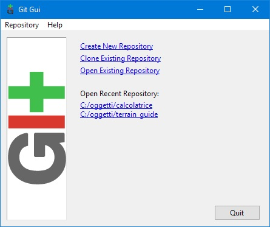
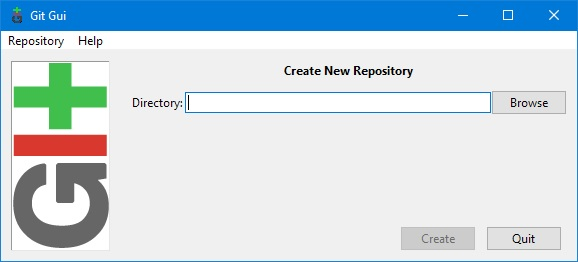
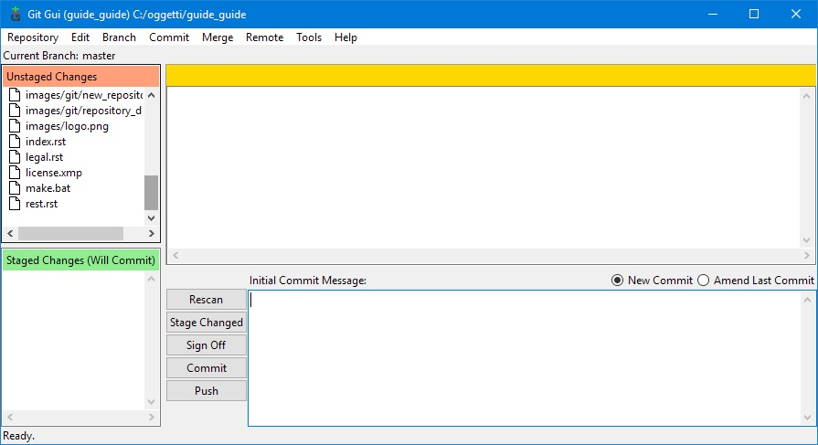

.. _git:

****************************
Gestire modifiche e versioni
****************************

Uno dei vantaggi di gestire la documentazione con dei file di testo e non con formati proprietari come
quelli dei word-processor (Word, Libre Office Writer...) è che si possono gestire con degli strumenti
di *versioning* che permettono di tenere traccia di tutte le modifiche anche se effettuate da persone diverse.

Questi strumenti, nati per i sorgenti dei programmi per computer, possono essere utilizzati in tanti altri campi:
anni fa scrissi una `guida su come utilizzarli per creare contenuti per un simulatore ferroviario <http://www.trainsimhobby.net/forum/viewtopic.php?f=27&t=11691>`_ 
in cui gran parte dei files erano testo.

Possono essere utilizzati anche con files binari, ma perdono alcune funzioni applicabili solo ai testi.

Utilizzeremo ``Git`` che ci facilita l'integrazione con un `sito per la condivisione <https://github.com/>`_ 
e la pubblicazione dei
nostri lavori come vedremo nel :ref:`prossimo capitolo <github>` .

.. _git-setup:

Installare Git
==============

L'installer del programma per Windows può essere `scaricato dal sito di Git <https://git-scm.com/download/win>`_ 

L'installer propone diversi pannelli con delle opzioni: per l'uso normale quelle di default vanno benissimo.

.. _git-repository-create:

Creare un repository
====================

Il repository è una struttura di file (gestita da Git) dove vengono archiviate tutte le modifiche ai file.

Il file .gitignore
------------------

Per impostazione predefinita vengono inclusi nel repository tutti i files e le sottocartelle della directory
che vogliamo gestire.

Abbiamo visto nel capito precedente che viene creata una cartella ``_build`` nella quale sono salvati i 
risultati delle elaborazioni e che non ci interessa includere nel repository. Per gestire queste eccezioni
si può creare un file ``.gitignore`` che contenga la lista dei file e cartelle da escludere.

Questo è il file presente in questo progetto:

.. literalinclude:: .gitignore
    :caption: .gitignore
    :name: rest-code-gitignore

Attivare il repository
----------------------

Clicchiamo con il tasto destro del mouse sulla cartella contenente il nostro progetto e dal menù 
che appare selezioniamo ``Git GUI here``

Dalla finestra riportata sopra selezioniamo ``Create New Repository`` 

Indichiamo la cartella del nostro progetto (possiamo anche selezionarla con il pulsante ``Browse``) 
e quindi clicchiamo su ``Create``.

Il primo commit
---------------

Il sistema ci presenterà questa nuova formati

nella quale elencherà i files presenti nella nostra cartella permettendoci di inserirli nel repository.

Avendo già impostato le esclusioni possiamo inserirli tutti cliccando sul pulsante ``Stage changed``. 
I files passeranno nel box sotto:

.. image:: images/git/staged.jpg

Per completare l'operazione di inserimento descriviamo i cambiamenti fatti nel box in basso a destra; 
essendo questo il primo commit scriviamolo come nell'esempio.

Non ci resta che premere il pulsante ``Commit`` ed il gioco è fatto.

Molto probabilmente vi apparirà questa segnalazione:

.. image:: images/git/cr_warning.jpg

che possiamo tranquillamente ignorare cliccando su ``Continue`` (è dovuta alla diversa gestione del 
*fine riga* tra le macchine Windows e Unix: Git utilizza il metodo di quest'ultimo e ci segnala che 
effettua una conversione per noi totalmente ininfluente)

Utilizzare il repository
========================

 