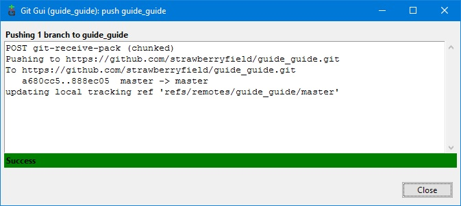
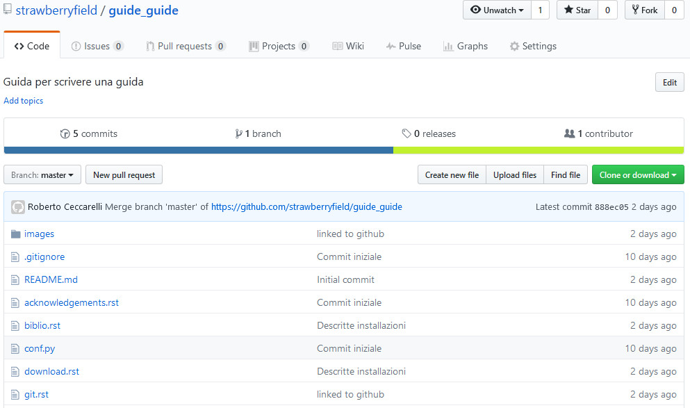

.. _github:

************************
Condividere e pubblicare
************************

Creare un repository su GitHub
==============================

Sincronizzare i repository
==========================

In questo momento abbiamo due repository separati: uno sul nostro PC ed uno su GitHub. 
Dovremo fondere i due repository in modo da poter replicare le modifiche locali sul repository remoto 
e viceversa.

Pull del repository remoto
--------------------------

Apriamo il prompt dei comandi nella nostra cartella di lavoro e scriviamo::

    git pull guide_guide master --allow-unrelated-histories
	
Ottenendo in risposta qualcosa di simile a questo::

    From https://github.com/strawberryfield/guide_guide
     * branch            master     -> FETCH_HEAD
    Merge made by the 'recursive' strategy.
    README.md | 2 ++
    1 file changed, 2 insertions(+)
    create mode 100644 README.md

Il repository su github è stato fuso con quello locale: ce ne accorgiamo 
perchè nella nostra directory di lavoro è apparso il file ``README.md`` 
che era l'unico presente nel repository remoto.

Push del repository locale
--------------------------

Riapriamo la GUI di Git e premiamo ``Push``

Con questa operazione trasferiamo il contenuto del repository locale su quello remoto. 
Non c'è nulla da modificare e quindi confermiamo premendo ``Push``.

Al termine del trasferimento riceveremo questa conferma:

Il nostro repository è stato trasferito su GitHub e se controlliamo dal sito possiamo vedere 
che ci sono tutti i nostri file

Mantenere sincronizzati i repository
====================================
