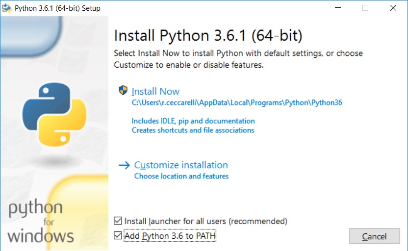

.. _rest:

***********
Il progetto
***********

Per realizzare la nostra guida utilizzeremo dei tools che gestiscono un linguaggio di markup
denominato `ReStructuredText <http://docutils.sourceforge.net/rst.html>`_ 

Grazie a questo set di strumenti redigeremo il testo con un normalissimo editor (il ``notepad`` di 
Windows può andare benissimo) e questo potrà essere trasformato in un set di pagine Web (o anche una 
pagina unica se lo preferiamo), un documento Pdf, un ebook e tanti altri formati.

Darò indicazione su come installare i programmi necessari in ambiente Windows, ma gli strumenti presentati
sono tutti multipiattaforma e si possono utilizzare benissimo anche su macchine Linux o Mac.

.. _rest-software:

Installare il software necessario
=================================

Innanzitutto è necessario accertarsi che il proprio PC abbia un interprete ``Python``, cosa comune
nelle macchine unix/linux, ma al contrario rara nelle macchine Windows

.. _rest-software-Python:

Python per Windows
------------------

Può essere scaricato dal sito `python.org <https://www.python.org/downloads/>`_ (scegliete l'installer
appropriato per il vostro PC, non il file zip).

Lanciamo l'installer

Spuntate entrambe le caselline in basso e poi avviate l'installazione standard confermando sempre 
le scelte proposte.

Al termine dell'installazione apparirà questo screen:

dove consiglio di cliccare sulla voce ``Disable path length limit`` prima di terminare.

.. _rest-software-sphinx:

Sphinx-build
------------

Se avete installato una versione recente di Python (come quella delle figure sopra) dovreste già trovarvi installato
``pip``, il gestore dei pacchetti di Python. Se così non fosse `leggete qui <http://www.sphinx-doc.org/en/stable/install.html>`_ 
come fare.

Aprite il prompt dei comandi e scrivete::

    pip install sphinx

Verranno scaricati ed installati alcuni pacchetti, al termine scrivete::

   sphinx-build -h

che, se tutto è andato a buon fine, vi mostrerà l'help del tool.

.. _rest-software-miktex:

MikTex
------

Il sistema di build non è in grado di generare direttamente dei file PDF, ma si appoggia ad un altro sistema di
composizione dei testi chiamato `LaTeX <https://www.latex-project.org/>`_. Dovremo quindi installare un interprete 
per tale linguaggio: utilizzeremo `MikTex <https://miktex.org/>`_.

L'installazione è banale: basta confermare tutte le opzioni proposte dall'installer.

.. _rest-startup:

Preparare la cartella di sviluppo
=================================

Siamo finalmente pronti ad iniziare il nostro progetto. Creiamo una cartella per contenerlo,
posizioniamoci al suo interno ed apriamo il prompt dei comandi. (Per chi non lo sapesse: 
tenere premuto il tasto ``SHIFT`` e fare click con il tasto destro del mouse; dal menu che appare selezionare 
``Apri finestra di comando qui``)

Nel prompt comandi scriviamo::

    sphinx-quickstart
	
A cui seguirà il dialogo riportato di seguito

.. literalinclude:: samples/sphinx-quickstart.txt
    :caption: sphinx-quickstart
    :name: rest-code-sphinx-quickstart

Mi sembra abbastanza semplice capire dove va inserito il vostro nome e quello del progetto; per tutto 
il resto potete dare le risposte dell'esempio.

Alla fine della procedura la cartella sarà popolata da alcuni files e directory: dovremo concentrare la nostra 
attenzione su due di loro.
	
.. _rest-startup-config-py:

Il file di configurazione
-------------------------

Questo file contiene tutte le impostazioni che regolano il *rendering* della nostra guida sulle varie piattaforme.
Non lo analizzeremo tutto, ma solo le parti su cui è necessario intervenire per ottenere lo stile con cui è stata 
compilata questa guida.

.. literalinclude:: samples/config-py-begin.txt
    :language: python
    :caption: config.py - preambolo
    :name: rest-code-config-py-begin

Nelle opzioni generali dobbiamo controllare

.. literalinclude:: samples/config-py-general.txt
    :language: python
    :caption: config.py - parametri generali
    :name: rest-code-config-py-general

Nella sezione HTML

.. literalinclude:: samples/config-py-html.txt
    :language: python
    :caption: config.py - HTML
    :name: rest-code-config-py-html

Nella sezione LaTeX

.. literalinclude:: samples/config-py-latex.txt
    :language: python
    :caption: config.py - LaTeX
    :name: rest-code-config-py-latex

	
.. _rest-startup-index-rst:

Il file index
-------------

Questo è il file che elenca tutti i file ``ReStructuredText`` che compongono la nostra guida.

Quello che segue è il file indice di questa guida che dovrete adattare per il vostro lavoro 
indicando (nell'ordine voluto) i file .rst che compongono la guida.

.. literalinclude:: index.rst
    :language: rest
    :caption: index.rst
    :name: rest-code-index-rst

Fate attenzione che l'identazione è fatta da quattro spazi e non da tabulazioni (che non funzionerebbero)

Non necessariamente va utilizzato un file per capitolo, potete organizzarvi come meglio credete.

Il file di licenza per i PDF
----------------------------

Non strettamente necessario, ma utile per realizzare file PDF che espongano la loro licenza 
ai motori di ricerca.

Sul sito di creative Commons potete generarlo utilizzado 
`questo form <https://creativecommons.org/choose/#metadata>`_ 
oppure potete modificare il file per adattarlo alla licenza che avete scelto.

Questo è il file utilizzato per questa guida:

.. literalinclude:: license.xmp
    :language: xml
    :caption: license.xmp
    :name: rest-code-license-xmp
